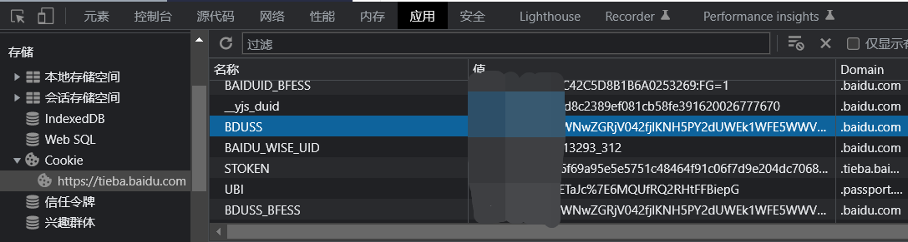
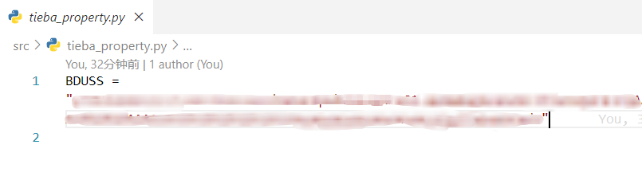
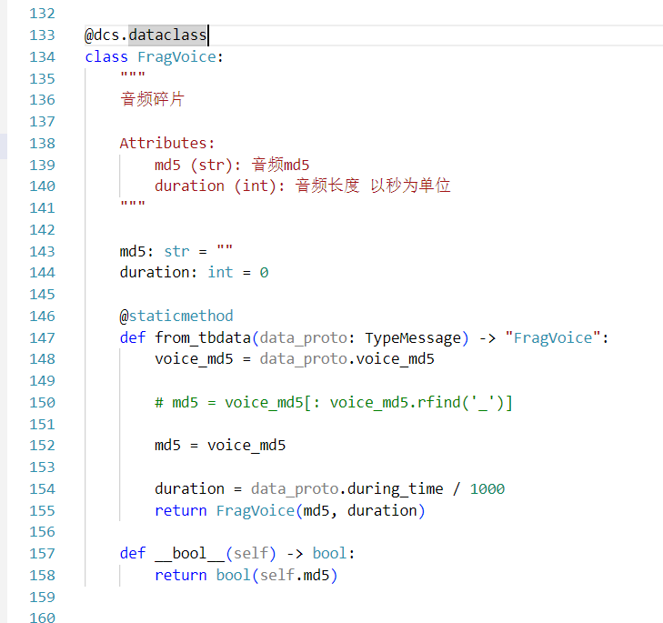
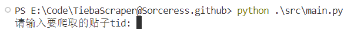
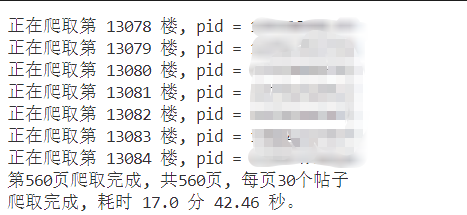

# TiebaScraper

贴吧的数据爬取工具，最大程度的保留原始内容。并且支持对图片、视频、语音等媒体文件的下载。

## TiebaReader

[TiebaReader](https://github.com/Sorceresssis/TiebaReader) 是与此项目对应的贴吧阅读器项目。目前还没有着手开发。

## 用法

### 安装依赖

python>=3.8

下载并打开项目后，在终端中运行以下命令安装依赖

```
pip install -r requirements.txt
```

### 配置 BDUSS

贴吧服务端使用 BDUSS 来确认用户身份

BDUSS 是一串由纯 ascii 字符组成的，长度为 192 的字符串

> **Warning**
>
> 使用 BDUSS 可以完成**一切**不需要手机/邮箱验证码的操作，包括 **发帖** / **发私信** /**获取账号上的所有历史发言**
>
> BDUSS 的过期时间长达数年，一般只能通过退出登录或修改密码使其失效
>
> 因此将 BDUSS 泄露给不受信任的人可能导致长期的账号安全风险和隐私泄露风险

在浏览器的 Cookie 和各种表单参数中你都能看到它的身影

搜索 你的浏览器型号+如何查看网站的 Cookie 就能知道如何获取你的贴吧账号的 BDUSS 了

以 Chrome 为例，在任何一个贴吧网页下按 【 F12 】 调出开发者选项，然后你就能在下图的位置找到它



把复制到的值填写到 `src/tieba_property.py` 中。用 `""`包裹赋后值给 BDUSS 变量即可



### 修改 aiotieba 库的源代码(语音下载)

没有语音获取需求可以跳过此步。

由于 aiotieba 库对语音的 md5 值做了截取处理，导致无法正确下载语音文件。所以要禁止 aiotieba 库对 md5 值做截取处理。

python 安装路径下的 `lib/site_packages/aiotieba` 就是 aiotieba 库的源代码目录。例如: `C:\Program Files\Python312\Lib\site-packages\aiotieba`

打开 aiotieba 源代码目录后打开 `api/_classdef.py` 文件。找到下图代码的位置并修改成下图代码



### 获取帖子的 tid

tid 类似于帖子的身份证。你可以从帖子的 url 中获取到它

例如 ：`https://tieba.baidu.com/p/8173224373?share=9105` 这个帖子的 tid 就是 `8173224373` , `?` 后面的文字都无关紧要。

移动端可以通过分享帖子然后复制连接获取 url

### 开始抓取

你可以直接在 `terminal` 输入 `python ./src/main.py` 运行程序, 然后根据提示输入相关信息即可



等待抓取完成。数据保存在工作目录下的 `scraped_data` 文件夹里。



## 数据保存的目录结构

爬取的数据保存在工作目录下的 `scraped_data` 文件夹里。

`forum_name`: 抓取贴的吧名

`main_tid` : 抓取贴的主贴 id

`thread_title` : 处理后的贴标题

`timestamp` : 抓取时间戳

`share_origin_tid` : 原始帖子的 tid(如果存在的话)

```powershell
[${forum_name}吧][${main_tid}]${thread_title}_${timestamp}
    ├───scraper_info.json # 保存一些关于本次抓取的信息
    ├───scrape.log  # 保存本次抓取的日志
    └───threads
        ├───${main_tid}
        │   ├───forum_avatar # 保存吧的头像
        │   ├───post_assets  # 保存帖子的媒体文件
        │   │   ├───images
        │   │   ├───videos
        │   │   └───voices
        │   ├───user_avatar # 保存用户的头像
        │   ├───content.db # 保存帖子内容
        │   ├───forum_info.json # 保存吧信息
        │   └───thread_info.json # 保存帖子信息
        └───${share_origin_tid} # 保存主贴的原帖子，如果存在的话
            ├───forum_avatar
            ├───post_assets
            │   ├───images
            │   ├───videos
            │   └───voices
            ├───user_avatar
            ├───content.db
            ├───forum_info.json
            └───thread_info.json

```

## References

内容的处理细节可以参考[note](./docs/note.md)

[数据库 DDL](./references/SQL/DDL.sql)

## 注意事项

已经注销的用户的爬取时会有信息缺失。

## License

[MIT License](./LICENSE.txt)
