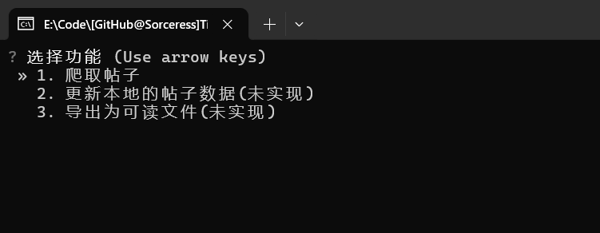
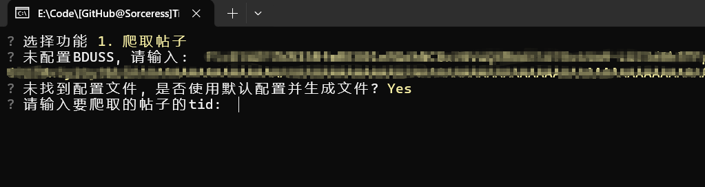
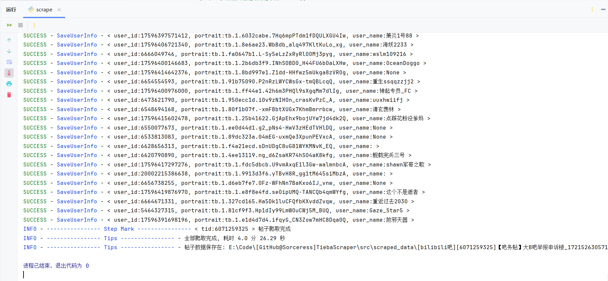

# TiebaScraper

贴吧的数据爬取工具，最大程度的保留原始内容。并且支持对图片、视频、语音等媒体文件的下载。

## TiebaReader

[TiebaReader](https://github.com/Sorceresssis/TiebaReader) 是与此项目对应的贴吧阅读器项目。爬取的数据可以用该工具阅读。点击该项目的 Releases 下载。

## 注意事项

1. 有时第一次运行会出现连接错误，多试几次即可。
2. 已经注销的用户保存的数据会有缺失。

## 使用可执行程序

这里介绍一下用可执行程序进行数据的抓取。

### 1. 开始

在 `releases` 里下载最新的可执行文件。解压后双击打开 `TiebaScraper.exe` 就会出现下图的命令行界面。

你可以通过方向键来选择你想要进行的操作



### 2. 获取 BDUSS

贴吧服务端使用 BDUSS 来确认用户身份

BDUSS 是一串由纯 ascii 字符组成的，长度为 192 的字符串

> **Warning**
>
> 使用 BDUSS 可以完成**一切**不需要手机/邮箱验证码的操作，包括 **发帖** / **发私信** /**获取账号上的所有历史发言**
>
> BDUSS 的过期时间长达数年，一般只能通过退出登录或修改密码使其失效
>
> 因此将 BDUSS 泄露给不受信任的人可能导致长期的账号安全风险和隐私泄露风险

在浏览器的 Cookie 和各种表单参数中你都能看到它的身影

搜索 你的浏览器型号+如何查看网站的 Cookie 就能知道如何获取你的贴吧账号的 BDUSS 了

以 Chrome 为例，在任何一个贴吧网页下按 【 F12 】 调出开发者选项，然后你就能在下图的位置找到它


### 3. 初始配置

第一次执行时需要进行一些配置。根据提示输入你的 `BDUSS` 。输入后程序会在同级目录下创建一个 `tieba_auth.json` 文件来保存 `BDUSS` 。爬取配置会先使用默认配置，并在同级目录下创建一个 `scrape_config.json` 文件来保存配置数据。

[爬取配置](./docs/scrape_config.md)



### 4. 获取帖子的 tid

tid 类似于帖子的身份证。你可以从帖子的 url 中获取到它

例如 ：`https://tieba.baidu.com/p/8173224373?share=9105` 这个帖子的 tid 就是 `8173224373` , `?` 后面的文字都无关紧要。

移动端可以通过分享帖子然后复制链接获取 url

### 5. 开始抓取

输入 `tid` 后按下回车键, 等待爬取完成。爬取到的数据保存在工作目录下的 `scraped_data` 文件夹里。

下面测试(下载高清用户头像) `6071259325` : `【吧务贴】大B吧举报申诉楼` , 回复数量: `18377` 条，文件数量: `6,419` , 数据大小: `1.22GB (1,315,974,348 字节)` , 耗时 `4分26.29秒` 。



## Docs

[爬取配置](./docs/scrape_config.md)

[贴吧数据 Note](./docs/tieba_data_notes.md)

[贴吧官方错误说明](./docs/tieba_error_desc.md)

[数据库 DDL](./docs/SQL/DDL.sql)

## 数据保存的目录结构

爬取的数据保存在工作目录下的 `scraped_data` 文件夹里。

`forum_name`: 抓取贴的吧名

`main_tid` : 抓取贴的主贴 id

`thread_title` : 处理后的贴标题

`timestamp` : 抓取时间戳

`share_origin_tid` : 主贴的转发原帖的 tid(如果存在的话)

```powershell
[${forum_name}吧][${main_tid}]${thread_title}_${timestamp}
    ├───scrape_info.json # 保存一些关于本次抓取的信息
    └───threads
        ├───${main_tid}
        │   ├───forum_avatar # 吧的头像
        │   ├───post_assets  # 帖子的媒体文件
        │   │   ├───images
        │   │   ├───videos
        │   │   └───voices
        │   ├───user_avatar # 用户的头像
        │   ├───content.db # 帖子内容
        │   ├───forum.json # 吧信息
        │   ├───scrape.log  # 抓取的日志
        │   ├───thread.json # 帖子信息
        │   └───update_${timestamp}.log # 更新日志
        └───${share_origin_tid} # 主贴的转发原帖，如果存在的话
            ├───forum_avatar
            ├───post_assets
            │   ├───images
            │   ├───videos
            │   └───voices
            ├───user_avatar
            ├───content.db
            ├───forum.json
            ├───scrape.log
            ├───thread.json
            └───update_${timestamp}.log

```

## 鸣谢

感谢这些项目作者的帮助。

-   [Starry-OvO/aiotieba: Asynchronous I/O Client for Baidu Tieba](https://github.com/Starry-OvO/aiotieba)
-   [n0099/tbclient.protobuf: 百度贴吧客户端 Protocol Buffers 定义文件合集](https://github.com/n0099/tbclient.protobuf)
