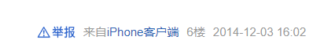
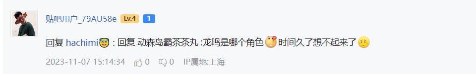

# 贴吧数据笔记

## User

### 用户唯一标识

**user_id**

可能为空，上古ip用户没有user_id.

user_id 可能不存在

`https://github.com/Starry-OvO/aiotieba/issues/213#issuecomment-2241636224`

**portrait**

一定不为空, 很重要的参数。

有多个版本。

**username**

可能为空，早期互联网需要填写用户名。但是现在很多账号没有用户名。

post 会保存一些关于用户的冗余字段。会保留一些被 `-` 代替的用户名。

接口请求到的 username 是经过处理的。

1. 电话号码类

电话号码会被隐私处理: `133******37`

```json
{
    "user_id": 1371763488,
    "portrait": "tb.1.e67e027b.vYbye7MZFu33wtZGvHLLdg",
    "user_name": "-",
    "nick_name_new": "璐村惂鐢ㄦ埛_QA3J3KS馃惥",
    "tieba_uid": 0,
    "glevel": 0,
    "gender": 1,
    "age": 9.9,
    "post_num": 1304,
    "agree_num": 0,
    "fan_num": 29,
    "follow_num": 15,
    "forum_num": 108,
    "sign": "新生的BIGER",
    "ip": "",
    "icons": ["wxshen", "wxxian", "wxyao"],
    "vimage": { "enabled": false, "state": "" },
    "is_vip": false,
    "is_god": false,
    "is_blocked": false,
    "priv_like": 3,
    "priv_reply": 1
}
```

2. 敏感字, 会被用 `-` 符号代替。

`你麻痹972`

```json
{
    "user_id": 1164702015,
    "portrait": "tb.1.8b4d3d91.a4jtPwNaT61v33tAzAFOTA",
    "user_name": "-",
    "nick_name_new": "贴吧用户_Q7Me34C",
    "tieba_uid": 0,
    "glevel": 0,
    "gender": 1,
    "age": 9.2,
    "post_num": 2612,
    "agree_num": 6,
    "fan_num": 85,
    "follow_num": 12,
    "forum_num": 9,
    "sign": "怪我咯。",
    "ip": "",
    "icons": [],
    "vimage": { "enabled": false, "state": "" },
    "is_vip": false,
    "is_god": false,
    "is_blocked": false,
    "priv_like": 3,
    "priv_reply": 1
}
```

`X1NPJ`

```json
{
    "user_id": 1604997478,
    "portrait": "tb.1.726db229.anu5OjnVZiPVETH8_E6VQg",
    "user_name": "-",
    "nick_name_new": "万志翔",
    "tieba_uid": 1134632183,
    "glevel": 2,
    "gender": 1,
    "age": 9.4,
    "post_num": 1233,
    "agree_num": 715,
    "fan_num": 0,
    "follow_num": 0,
    "forum_num": 0,
    "sign": "",
    "ip": "内蒙古",
    "icons": [],
    "vimage": { "enabled": false, "state": "" },
    "is_vip": false,
    "is_god": false,
    "is_blocked": false,
    "priv_like": 1,
    "priv_reply": 1
}
```

`贴吧用户_0002VDb🐾`

```json
{
    "user_id": 579507,
    "portrait": "tb.1.25502702.BrAM9CZAwzNgOWADvgm_JQ",
    "user_name": "-",
    "nick_name_new": "贴吧用户_0002VDb🐾",
    "tieba_uid": 10243430,
    "glevel": 0,
    "gender": 2,
    "age": 19.9,
    "post_num": 671826,
    "agree_num": 948,
    "fan_num": 48,
    "follow_num": 0,
    "forum_num": 216,
    "sign": "不同的人在用别搞混啦",
    "ip": "",
    "icons": [],
    "vimage": { "enabled": false, "state": "" },
    "is_vip": false,
    "is_god": false,
    "is_blocked": false,
    "priv_like": 3,
    "priv_reply": 1
}
```

`百度用户#981758301`

```json
{
    "user_id": 811989719,
    "portrait": "tb.1.e1543ca9.sIAxKFosukK97_rHsI4fKw",
    "user_name": "-",
    "nick_name_new": "璐村惂鐢ㄦ埛_0EJ1yMe馃惥",
    "tieba_uid": 0,
    "glevel": 0,
    "gender": 1,
    "age": 11.5,
    "post_num": 2768,
    "agree_num": 2,
    "fan_num": 47,
    "follow_num": 57,
    "forum_num": 28,
    "sign": "大爱六六",
    "ip": "",
    "icons": [],
    "vimage": { "enabled": false, "state": "" },
    "is_vip": false,
    "is_god": false,
    "is_blocked": false,
    "priv_like": 2,
    "priv_reply": 1
}
```

`贴吧用户_06y9CQW`

```json
{
    "user_id": 568818738,
    "portrait": "tb.1.66a5b431.2vB54rBhK3J7pvxZ2Mc3ng",
    "user_name": "-",
    "nick_name_new": "贴吧用户_06y9CQW",
    "tieba_uid": 37499515,
    "glevel": 0,
    "gender": 1,
    "age": 12.5,
    "post_num": 3665,
    "agree_num": 15,
    "fan_num": 43,
    "follow_num": 134,
    "forum_num": 17,
    "sign": "我就是我，不是五毛一盒的烟火，，，，，",
    "ip": "安徽",
    "icons": [],
    "vimage": { "enabled": false, "state": "" },
    "is_vip": false,
    "is_god": false,
    "is_blocked": false,
    "priv_like": 3,
    "priv_reply": 1
}
```

**tieba_uid**

可能为空， 也没什么用

### 头像

目前百度贴吧移动端用 `portrait` 这一参数来请求头像图片。

```powershell
# 小头像
 # t=$timestamp 这个参数我猜测是头像修改的时间
https://gss0.baidu.com/7Ls0a8Sm2Q5IlBGlnYG/sys/portrait/item/$portrait?t=$timestamp
http://tb.himg.baidu.com/sys/portrait/item/$portrait

# 高清头像
https://himg.bdimg.com/sys/portraith/item/$portrait
```

> 要注意的是，你在网页端浏览帖子时看到的用户头像可能会与爬取到的图片不一样。因为爬取头像依靠的是 `https://himg.bdimg.com/sys/portraith/item/$portrait` 这个接口。网页端由于其特殊的加载方式导致有些有年代的帖子会加载过时的头像（用户以前的头像）。

### level 和 glevel 的区别

level 吧内等级

glevel 贴吧成长等级

## 内容

### 分块编号

```python
_type = proto.type
# 0纯文本 9电话号 18话题 27百科词条 40梗百科
if _type in [0, 9, 18, 27, 40]:
    frag = FragText_p.from_tbdata(proto)
    texts.append(frag)
    yield frag
# 11:tid=5047676428
elif _type in [2, 11]:
    frag = FragEmoji_p.from_tbdata(proto)
    emojis.append(frag)
    yield frag
# 20:tid=5470214675
elif _type in [3, 20]:
    frag = FragImage_p.from_tbdata(proto)
    imgs.append(frag)
    yield frag
elif _type == 4:
    frag = FragAt_p.from_tbdata(proto)
    ats.append(frag)
    texts.append(frag)
    yield frag
elif _type == 1:
    frag = FragLink_p.from_tbdata(proto)
    links.append(frag)
    texts.append(frag)
    yield frag
elif _type == 10:  # voice
    frag = FragVoice_p.from_tbdata(proto)
    nonlocal voice
    voice = frag
    yield frag
elif _type == 5:  # video
    frag = FragVideo_p.from_tbdata(proto)
    nonlocal video
    video = frag
    yield frag
# 35|36:tid=7769728331 / 37:tid=7760184147
elif _type in [35, 36, 37]:
    frag = FragTiebaPlus_p.from_tbdata(proto)
    tiebapluses.append(frag)
    texts.append(frag)
    yield frag
# outdated tiebaplus
elif _type == 34:
    continue
```

### 语音

每条帖子只能发送一条语音。

```json
{
    "voice": {
        "md5": "",
        "duration": 0
    }
}
```

语音下载地址

```powershell
https://tiebac.baidu.com/c/p/voice?voice_md5=$voice_md5&play_from=pb_voice_play
```

### AT 分块

at 分块显示的文字是用户当时的 nickname. 不是 username.

```python
FragAT(
    text='$nickname',
    user_id=0
)
```

### Emoji

```csharp
  const emoticonsIndex = {
        image_emoticon: { class: 'client', ext: 'png' }, // 泡泡(<51)/客户端新版表情(>61)
        // image_emoticon: { class: 'face', ext: 'gif', prefix: 'i_f' }, // 旧版泡泡
        'image_emoticon>51': { class: 'face', ext: 'gif', prefix: 'i_f' }, // 泡泡-贴吧十周年(51>=i<=61)
        bearchildren_: { class: 'bearchildren', ext: 'gif' }, // 贴吧熊孩子
        tiexing_: { class: 'tiexing', ext: 'gif' }, // 痒小贱
        ali_: { class: 'ali', ext: 'gif' }, // 阿狸
        llb_: { class: 'luoluobu', ext: 'gif' }, // 罗罗布
        b: { class: 'qpx_n', ext: 'gif' }, // 气泡熊
        xyj_: { class: 'xyj', ext: 'gif' }, // 小幺鸡
        ltn_: { class: 'lt', ext: 'gif' }, // 冷兔
        bfmn_: { class: 'bfmn', ext: 'gif' }, // 白发魔女
        pczxh_: { class: 'zxh', ext: 'gif' }, // 张小盒
        t_: { class: 'tsj', ext: 'gif' }, // 兔斯基
        wdj_: { class: 'wdj', ext: 'png' }, // 豌豆荚
        lxs_: { class: 'lxs', ext: 'gif' }, // 冷先森
        B_: { class: 'bobo', ext: 'gif' }, // 波波
        yz_: { class: 'shadow', ext: 'gif' }, // 影子
        w_: { class: 'ldw', ext: 'gif' }, // 绿豆蛙
        '10th_': { class: '10th', ext: 'gif' } // 贴吧十周年
    } as const;
```

## Post

### 文件唯一标识

目前来看贴吧应该用是 md5

### IP 属地

贴吧不是每个帖子都保存发布时的 ip 地址。会随着用户的 ip 改变

有些没有一直没登陆的用户爬不出 ip。

### reply_num

只会增加。不会减少。

删除楼中楼，不会减少 reply_num 的值。

### 话题

话题是纯文本。用##包裹，

用百度的 api 去搜索。

### 视频

每条贴子只能发一条视频。

```json
{
    "video": {
        "src": "",
        "cover_src": "",
        "duration": 0,
        "width": 0,
        "height": 0,
        "view_num": 0
    }
}
```

### tiebapluse

我不知道这是什么东西，没见过。

### 小尾巴 sign

已经发布的小尾巴不会随着用户修改小尾巴而改变。

### 设备 （无）

网页端会显示设备，但是移动端 api 没有设备信息。



### 自定义填字表情包

## Comments(sub-post)

结构与 post 基本相似

### 被回复者(reply_to)

贴吧表达被回复者有三种方式

**1. 把被回复者的昵称写入 contents 的 FragText**

早期帖子的方式。

直接把被回复者的 `昵称(nickname)` 嵌入到文本分块中, 太草了用的昵称，好歹用用户名呢，我都没办法修复数据。

```json
回复 $nickname :
```

**2. 写入 contents 的 FragText 和 FragAT**

早期帖子的方式。使用 FragText 和 FragAt 配合使用。

```powershell
Contents(
    objs=[
        FragText(
            text='回复 '
        ),
        FragAT(
            text='$nickname',
            user_id=0
        )
        FragText(
            text=' :'
        ),
    ]
)
```

**3. 使用 reply_to_id 字段**

目前官方使用的方法。用 reply_to_id 属性表明回复者。

下面是既有 reply_to_id 也把被回复者当时的昵称给嵌入到了帖子内容时的抽象显示。



## Thead

### 转发贴(share_origin)

转发贴不能嵌套。

只能两层。其他转发贴始终指向的是第一层的原帖。

```json
{
    "share_origin": {
        "contents": {
            "objs": [],
            "texts": [],
            "emojis": [],
            "imgs": [],
            "ats": [],
            "links": [],
            "tiebapluses": [],
            "video": {
                "src": "",
                "cover_src": "",
                "duration": 0,
                "width": 0,
                "height": 0,
                "view_num": 0
            },
            "voice": {
                "md5": "",
                "duration": 0
            }
        },
        "title": "",
        "fid": 0,
        "fname": "",
        "tid": 0,
        "author_id": 0,
        "vote_info": {
            "title": "",
            "is_multi": false,
            "options": [],
            "total_vote": 0,
            "total_user": 0
        }
    }
}
```

### 投票

```json
{
    "vote_info": {
        "title": "t",
        "is_multi": false,
        "options": [
            {
                "vote_num": 1488,
                "text": "t1"
            },
            {
                "vote_num": 304,
                "text": "t2"
            }
        ],
        "total_vote": 1792,
        "total_user": 1792
    }
}
```
