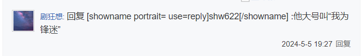
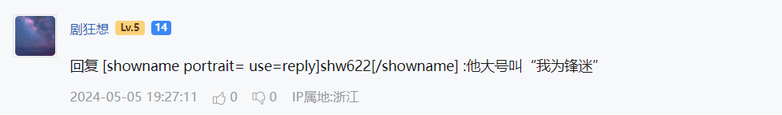
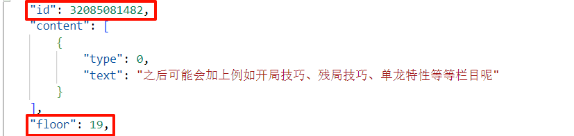
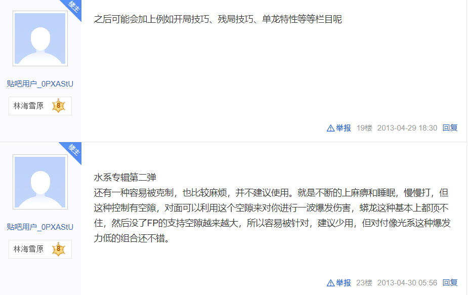
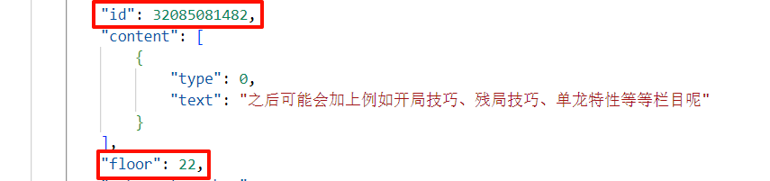

# 贴吧错误说明

## 被回复者显示错误

[参考资料: NOTE#被回复者](./note.md#被回复者)

**官方网页显示**



**TiebaReader 显示**



**说明**

这就是把被回复者嵌入到文本分块的错误。

这是一个类似 html 的标签

```html
<showname portrait="" use="" reply>shw622</showname>
```

这个被回复者的用户名是 shw622 。应该是没有 portrait,use 导致的解析失败。

既然是被回复者，那么你一定可以在回复列表中找到这个人的评论。除非已被删除。

TiebaScraper 没有对这个错误进行处理。因为这个错误的检测会误判。可能会有人的发送的内容就是 `[showname] name [/showname]`

## 不当删除操作使的请求到的数据重复

### 例子

tid: `2267343048`

这个是第一页的最后一条 post。为 `19` 楼



实际上的 `22` 楼已经被删除。



但是请求到的第二页数据的第一条 post。却拿到了 `22` 楼数据，且实际数据本质上是 `19` 楼的数据。`id `和 `content` 都一样



本程序的数据库给 pid 设置了唯一约束。 来解决这一问题
